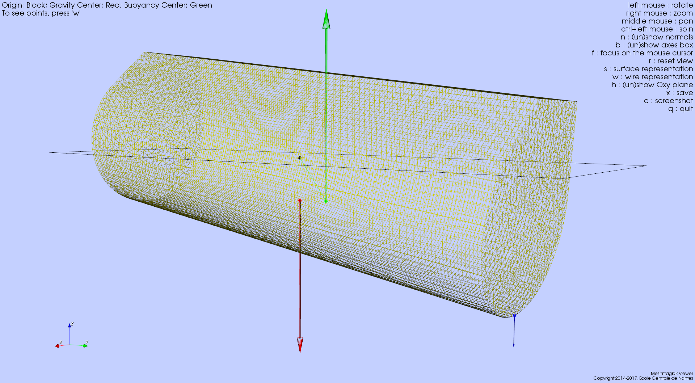

Using Meshmagick
================

.. note::

    * Mesh files examples used through this page are available under the `meshmagick/tests/data` directory so that you
      can play with them.
    * Images that illustrate the examples have been obtained with the Meshmagick's viewer and by pressing the ``c``
      keystroke.
    * Most of the command line options may be combined.

.. contents:: Content
    :local:
    :backlinks: top

.. highlight:: bash

Getting help
------------

You can get command line help by issuing the following command::

    >$ meshmagick -h

The output of this command is reproduced in the :any:`Command Line Interface Reference Guide <cli_reference>`.

Converting a mesh file
----------------------

Converting a mesh file is one of the most basic usage of Meshmagick::

    >$ meshmagick SEAREV.vtp -o SEAREV.mar

The format of the file is generally guessed from the extensions. Sometimes the extension may not be explicit
enough to guess the file format. You should then use the ``-ifmt (--input-format)`` and
``-ofmt (--output-format)`` options to explicitly declare the file format::

    >$ meshmagick SEAREV.vtp -ifmt paraview SEAREV.vtp -ofmt nemoh SEAREV.dat

This way, we told Meshmagick that SEAREV.dat must be in the
`Nemoh <https://lheea.ec-nantes.fr/doku.php/emo/nemoh/start>`_ input mesh file format.

Quiet mode
----------

To switch off outputs of Meshmagick, use the ``-q (--quiet)`` option::

    >$ meshmagick SEAREV.vtp -q

Getting information on a mesh
-----------------------------

Quick information
~~~~~~~~~~~~~~~~~

Quick information on a mesh is given by the ``-i (--info)`` option::

    >$ meshmagick SEAREV.vtp -i

That gives us the following output:

.. program-output:: python ../meshmagick/meshmagick.py ../meshmagick/tests/data/SEAREV.vtp -i

Mesh quality metrics
~~~~~~~~~~~~~~~~~~~~

You can get some quality metrics on the mesh by issuing::

    >$ meshmagick SEAREV.vtp --quality

that gives:

.. program-output:: python ../meshmagick/meshmagick.py ../meshmagick/tests/data/SEAREV.vtp --quality

.. note::

    This option requires that you have installed a version of the python VTK library as it is used to compute these
    metrics. It relies on the **verdict** library, initially developed at Sandia lab and later included into VTK. More
    information on the metrics can be seen in the
    `Verdict manual <http://www.vtk.org/Wiki/images/6/6b/VerdictManual-revA.pdf>`_.

Mesh file visualization
-----------------------

Quickly viewing a mesh can be achieved by using the following command::

    >$ meshmagick SEAREV.vtp --show

that opens the internal Meshmagick's viewer.

.. image:: ../img/viewer.png

.. note::

    The viewer relies on VTK, so the python VTK library must be installed in order to use it.

The viewer is blazing fast and support mesh manipulation with the mouse. Some keyboard keys are available and their
usage is indicated in the upper right panel.

Certainly the most useful feature is the visualization of normals by pressing the ``n`` keystroke so that you can verify
consistency of normals across the mesh as well as orientation (must generally be outward for computations).

.. image:: ../img/viewer_options.png

The above screenshot has been obtained by pressing successively the keys ``n`` (showing normals), ``w`` (wire
representation), ``h`` (show Oxy plane i.e. the water free surface) and ``c`` (to save a screenshot that is saved
under the name ``screenshot.png`` in the current working directory.)

**Just play with options to discover what is available !**

.. note::

    The frame at the lower left corner is draggable and resizable so that you can inspect your mesh for alignment or
    whatever you want.

Mesh healing
------------

Meshmagick offers some options to deal with mesh description. Sometimes, meshes are produced with duplicated vertices
description, making it impossible to establish some advanced connectivities. This is intrinsically the case for e.g. in
GDF files, the input mesh file format of `Wamit <http://www.wamit.com/>`_ where faces are internally represented by
vertices coordinates only, without using a connectivity table.

Sometimes also, faces normals are not consistent. This is often the case by e.g. when using `GMSH <http://gmsh.info/>`_
mesh generator. You may also want to flip every normals.

Removing duplicate vertices
~~~~~~~~~~~~~~~~~~~~~~~~~~~

The ``-md (--merge-duplicates)`` option does this::

    >$ meshmagick coque.gdf -md

that gives:

.. program-output:: python ../meshmagick/meshmagick.py ../meshmagick/tests/data/coque.gdf -md

This allows to generate connectivity tables in the mesh and may drastically reduce the mesh size in memory and on disk.

Healing normals
~~~~~~~~~~~~~~~

This is obtained by using the ``-hn (--heal-normals)`` command line option. Let's have an example. In the
`meshmagick/tests/data` folder, you can find the file ``cylinder.geo`` that is a geometry file using the *GMSH*
language for modeling geometry. It models the eighth of a cylinder.

If you have *GMSH* on your computer, you can generate a mesh file from this file by issuing the
following command in your terminal::

    >$ gmsh -2 cylinder.geo

It will generate a file named ``cylinder.msh`` which is a surface mesh of the portion of cylinder. One thing that you
can do is to visualize this mesh with the ``--show`` option::

    >$ meshmagick cylinder.msh --show

and stroke ``n`` to watch normals.

.. image:: ../img/cylinder_msh_normals.png

It is clear that *GMSH* did not orient the normals consistently. Now, you can heal them by issuing by e.g.::

    >$ meshmagick cylinder.msh -hn -o cylinder_healed.vtp --show

which heals the normals, opens the Meshmagick's viewer and writes the healed mesh as a *vtp* file that can be opened
into *Paraview*.

.. image:: ../img/cylinder_msh_normals_healed.png

.. note::

    This option uses a `flood fill algorithm <https://en.wikipedia.org/wiki/Flood_fill>`_ to diffuse the normal
    orientation information. For doing so, it requires to establish a connectivity map for faces/faces adjacency. For
    this map to be realized, it is necessary to merge duplicate nodes before healing normals. When invoking the
    ``-md (--merge-duplicates)`` and ``-hn (--heal-normals)`` options at the same time, merging is done
    before healing so it is verified.

.. warning::

    If your mesh is not conformal, this option **may** fail as the connectivity map used by the flooding algorithm
    **may** present some non connected patches of faces that will be flooded independently, making the transit of
    normal orientation between these patch impossible.

.. note::

    If the mesh is closed and conformal, a side effect of this option is to test if the normals are outgoing and
    correct them if they are not. This is achieved by "plunging the mesh in water" and integrate the hydrostatics
    pressure to identify the resultant force orientation which must be along the positive vertical in case the
    normals are outgoing. If the mesh does not allow this checking, normals are nevertheless made consistent and you are
    warned about the eventual need to manually watch the normals from the Meshmagick's viewer and issue a new command
    to flip the whole normals as described in the following.

Flipping normals
~~~~~~~~~~~~~~~~

This can be done with the ``-fn (--flip-normals)`` option. Based on the ``cylinder.vtp`` file obtained just
before, if we issue the following command::

    >$ meshmagick cylinder.vtp -fn --show

we get:

.. image:: ../img/cylinder_msh_normals_flipped.png

Global healing
~~~~~~~~~~~~~~

When getting a mesh file from somewhere, you could use the ``-hm (--heal-mesh)`` option to automatically apply a
set of sanity checks and modifications on the mesh. It successively applies the following operations:

* Removes unused vertices
* Removes degenerated faces
* Merge duplicate vertices
* Heal triangles description
* Heal normal orientations

The command is then::

    >$ meshmagick cylinder.msh -hm

that outputs:

.. program-output:: python ../meshmagick/meshmagick.py ../meshmagick/tests/data/cylinder.msh -hm

Mesh transformations
--------------------

Some basic mesh transformation options are available: translations, rotations, scaling.

Translations
~~~~~~~~~~~~

The options to use are ``-tx (--translatex)``, ``-ty (--translatey)``, ``-tz (--translatez)``,
``-t (--translate)`` which respectively performs translations along the x axis, the y axis, the z axis and along a
coordinate vector. The invocations are::

    >$ meshmagick SEAREV.vtp -tx 10
    >$ meshmagick SEAREV.vtp -ty 10
    >$ meshmagick SEAREV.vtp -tz 10

    >$ meshmagick SEAREV.vtp -t 10 10 10 -i

for translations of 10 along specific axes and along the coordinate vector (10, 10, 10). The last command gives:

.. program-output:: python ../meshmagick/meshmagick.py ../meshmagick/tests/data/SEAREV.vtp -t 10 10 10 -i

Rotations
~~~~~~~~~

The options to use are ``-rx (--rotatex)``, ``-ry (--rotatey)``, ``-rz (--rotatez)``,
``-r (--rotate)`` which respectively performs rotations around the x axis, the y axis, the z axis and a 3D
rotation along fixed axis rotation vector. The invocations are::

    >$ meshmagick SEAREV.vtp -rx 90
    >$ meshmagick SEAREV.vtp -ry 90
    >$ meshmagick SEAREV.vtp -rz 90

    >$ meshmagick SEAREV.vtp -r 90 90 90 -i

for rotations of 90° around specific axes and around the rotation coordinate vector (90, 90, 90). The last command
gives:

.. program-output:: python ../meshmagick/meshmagick.py ../meshmagick/tests/data/SEAREV.vtp -r 90 90 90 -i

.. warning::

    * When using the ``-r (--rotate)`` option, please keep in mind that the angles given are not the Cardan angles
      (Roll, Pitch, Yaw) but angles around a fixed rotation axis.
    * Angles must be given in degrees.

Scaling
~~~~~~~

The options to use are ``-sx (--scalex)``, ``-sy (--scaley)``, ``-sz (--scalez)``,
``-s (--scale)`` which respectively performs scaling along the x axis, the y axis, the z axis and a 3D
scaling of the mesh. The invocations are::

    >$ meshmagick SEAREV.vtp -sx 2
    >$ meshmagick SEAREV.vtp -sy 2
    >$ meshmagick SEAREV.vtp -sz 2

    >$ meshmagick SEAREV.vtp -s 2 -i

for scaling of 2 along specific axes and of the whole mesh in space. The last command gives:

.. program-output:: python ../meshmagick/meshmagick.py ../meshmagick/tests/data/SEAREV.vtp -s 2 -i

.. warning::

    Scaling is performed before any translations when both options are used. So the translation magnitudes must be
    adapted to be consistent with the new scale of the mesh.

Triangulating quadrangles
-------------------------

The ``-tq (--triangulate-quadrangles)`` allows to split every quadrangle faces in the mesh into two triangle::

    >$ meshmagick cylinder.msh -tq --show

that displays the following:

.. program-output:: python ../meshmagick/meshmagick.py ../meshmagick/tests/data/cylinder.msh -tq

.. image:: ../img/triangulate.png

.. warning::

    The splitting procedure is basic and keep in mind that no check is done on the quality of the generated triangles.
    If your mesh faces does not have a good aspect ratio, it could produce some really tiny triangles.

Working with planes
-------------------

Planes may be used in different situation as seen below. They can be defined so as to perform mesh clipping (useful
to provide the submerged part of the mesh to hydrodynamics BEM software such as Nemoh), symmetrizing (when only a
part of the mesh has been generated as in the ``cylinder.geo`` gmsh geometry file example) or mirroring.

A plane is defined by its normal :math:`\vec{n}` and a scalar parameter :math:`c` following the equation
:math:`\vec{n}.\vec{x} = c`, where :math:`\vec{x}` is the coordinate vector of a point belonging to the plane.

The scalar parameter :math:`c` is practically the orthogonal distance between the origin of the reference frame and
the plane.

Working with planes is quite flexible as you have 3 mean to use them along with plane dependent options:

* Defining the plane by 4 scalars:  :math:`n_x, n_y, n_z, c`
* Using predefined plane keywords:
    - Oxy
    - Oxz
    - Oyz
    - /Oxy
    - /Oxz
    - /Oyz
* Using the index of a plane that has been defined with the ``-p (--plane)`` option.

Defining planes
~~~~~~~~~~~~~~~

A plane may be defined at the command line level along with de ``-p (--plane)`` option::

    >$ meshmagick SEAREV.vtp -p 0 0 1 0

defines the plane with normal (0, 0, 1) and the scalar parameter 0.

It is also possible to define the same plane by a predefined keyword argument::

    >$ meshmagick SEAREV.vtp -p Oxy

Predefined keywords arguments are Oxy, Oxz, Oyz, /Oxy, /Oxz, /Oyz and are self descriptive. The slash indicates that
the normals is reversed.

It is possible to define several planes at once such as in::

    >$ meshmagick SEAREV.vtp -p Oxy -p /Oxz

When defining planes with the ``-p (--plane)`` option, the planes definitions are internally stored in a list in
the order that you used in the command line and it is then possible to refer to them in other options by their index in
the list, starting by 0. So in the above command line, the plane Oxy can be refereed as the plane index 0 and the /Oxz
plane as the plane index 1.

Clipping a mesh by a plane
~~~~~~~~~~~~~~~~~~~~~~~~~~

To clip a mesh against a plane, use the ``-c (--clip)`` option like in::

    >$ meshmagick SEAREV.vtp -c 1 1 1 2 --show

that displays the following view:

.. image:: ../img/clip.png

As said before, the above command is strictly equivalent to::

    >$ meshmagick SEAREV.vtp -p 1 1 1 2 -c 0 --show

It is also possible to use several ``-c (--clip)`` option at a time::

    >$ meshmagick SEAREV.vtp -c Oxy -c Oyz --show

that gives:

.. image:: ../img/clip2.png

.. note::

    It is possible to invoke the ``-c (--clip)`` option without any argument. In that case, a default Oxy plane
    is taken.

.. note::

    The part of the mesh that is kept is that opposite to the plane's normal orientation.

Symmetrizing a mesh about a plane
~~~~~~~~~~~~~~~~~~~~~~~~~~~~~~~~~

To symmetrize a mesh about a plane, use the ``--sym (--symmetrize)`` option. Taking back the ``cylinder.msh``
example generated sooner, we can issue::

    >$ meshmagick cylinder.msh --sym Oxy --show

that gives:

.. image:: ../img/cylinder_sym.png

Combining the options allow us to close the cylinder::

    >$ meshmagick cylinder.msh --sym Oxy --sym Oxz --sym Oyz --show

that gives:

.. image:: ../img/cylinder_sym3.png

Checking normals gives as expected:

.. image:: ../img/cylinder_sym3_normals.png

that we can heal::

    >$ meshmagick cylinder.msh --sym Oxy --sym Oxz --sym Oyz -hn --show

.. image:: ../img/cylinder_sym3_normals_healed.png

and clip back::

    >$ meshmagick cylinder.msh --sym Oxy --sym Oxz --sym Oyz -hn -c Oxy -c Oyz -c Oxz --show

making us confident with respect to the normal consistency and orientation (outward) of our open part of cylinder mesh:

.. image:: ../img/cylinder_sym3_normals_healed_clip.png

.. note::

    Faces quality on the vicinity of the clipping plane is not checked. You can then generate faces with very poor
    aspect ratio. This will be fixed in a future Meshmagick's release by applying a projection procedure that is
    nontrivial to develop as it must not modify the geometry locally.

Getting inertial properties of the mesh
---------------------------------------

Meshmagick allows to calculate inertial properties of meshes based on some assumptions on the mass distribution:

* A mesh which is **uniformly filled** with an homogeneous medium with a given density (the practical interest if for
  e.g. for ballast modeling).
* A mesh considered as a **shell** having a constant thickness and made in a medium of a given density (approximation
  for floating structures).

.. todo::

    Add  keywords for available medium...

.. warning::

    * **Inertial properties** are:

        * The **mass** :math:`m` (tons)
        * The position of the **center of gravity** in the mesh's reference frame :math:`\vec{OG}`
        * The (3x3) symmetric 3D rotational **inertia matrix** :math:`\mathbf{I}_O`

    * The inertia matrix must be expressed with respect to a *reduction point*. Internally, inertia calculations are
      done in the mesh's reference frame (where vertices coordinates are expressed) so **the default inertia matrix is
      expressed at the mesh's origin**. Please see the ``--reduction-point`` and ``--at-cog`` options to specify an
      other reduction point.

    * Note also that the default unit for mass in Meshmagick is the ton ! This is of practical use in offshore
      applications.

.. note::

    * Pay attention that the inertia products Ixy, Ixz and Iyz have the real significance and they should be used with
      a minus sign when put in a 3D rotational inertia matrix as in :math:`\mathbf{I}_O = \begin{bmatrix} I_{xx} &
      -I_{xy} & -I_{xz} \\ -I_{xy} & I_{yy} & -I_{yz} \\ -I_{xy} & -I_{yz} & I_{zz} \end{bmatrix}`.

    * Coefficients are given by:

        * :math:`I_{xx} = \iint_{S_w}(y^2+z^2)dS`
        * :math:`I_{xy} = \iint_{S_w}xydS`
        * :math:`I_{xz} = \iint_{S_w}xzdS`
        * :math:`I_{yy} = \iint_{S_w}(x^2+z^2)dS`
        * :math:`I_{yz} = \iint_{S_w}yzdS`
        * :math:`I_{zz} = \iint_{S_w}(x^2+y^2)dS`

Defining the medium density
~~~~~~~~~~~~~~~~~~~~~~~~~~~

The medium density, for both assumptions on mass distribution in the mesh, is done by using the ``--rho-medium``
option::

    >$ meshmagick SEAREV.vtp --rho-medium 1023

.. note::

   Density must be given in kg/m**3 unit.

.. note::

    In the above command line, we specified a meshfile as an option although we have no mesh processing at all, the
    aim being to get the list of available medium. This is a limitation of the ``argparse`` Python module that is
    used in Meshmagick to parse command line options and arguments. This module does not allow to define optional
    arguments that overhelms the mandatoriness of the positional arguments. Except for the ``--help`` command line
    option, you always have to specify a mesh file while calling Meshmagick.

It is also possible to use some default medium density keywords. These keywords can be retrieved using the
``--list-medium`` option::

    >$ meshmagick SEAREV.vtp --list-medium

.. program-output:: python ../meshmagick/meshmagick.py ../meshmagick/tests/data/SEAREV.vtp --list-medium

An other solution is to look at the ``--help`` output.

.. todo::

    * Faire que argparse émette un warning si on a des options non reconnues.
    * Ajouter la possibilité d'exprimer les matrices résultat en un point de réduction particulier. Cette option
      qu'on nomera --reduction-point (-rp) sera utilisee a la fois par les inerties et par la matrice raideur
    * On mettra aussi en place une option --at-cog pour que le poitn de reduction soit specifie au cetre de gravite

Guessing the mesh is filled with homogeneous medium
~~~~~~~~~~~~~~~~~~~~~~~~~~~~~~~~~~~~~~~~~~~~~~~~~~~

This is achieved by using the ``-pi (--plain-inertia)`` option::

    >$ meshmagick SEAREV.vtp -pi --rho-medium 800

that gives:

.. program-output:: python ../meshmagick/meshmagick.py ../meshmagick/tests/data/SEAREV.vtp -pi --rho-medium 800

.. note::
    If the medium's density is not specified, the ``-pi`` option guesses that the medium is salt water and then takes a
    default density of 1023 kg/m**3.

Guessing the mesh is a shell
~~~~~~~~~~~~~~~~~~~~~~~~~~~~

This is achieved by using the ``-si (--shell-inertia)`` option::

    >$ meshmagick SEAREV.vtp -si --rho-medium 5850 --thickness 0.02

that gives:

.. program-output:: python ../meshmagick/meshmagick.py ../meshmagick/tests/data/SEAREV.vtp -si --rho-medium 5850
                    --thickness 0.02

.. note::

    * If the ``--rho-medium`` option is not specified, the medium density is by default considered that of steel (5850
      kg/m**3)
    * If the ``--thickness`` option is not specified, the thickness of the shell is by default considered being 0.02
      meters.

Performing hydrostatics calculations on the mesh
------------------------------------------------

Meshmagick allows to perform some hydrostatics computations on meshes. You can get the current hydrostatics
properties of the mesh such as the hydrostatic stiffness matrix, metacentric heights, floating plane area...

It is also able to compute the hydrostatic equilibrium of the mesh with respect to a given floater mass and/or a
given position of the center of gravity as well as additional external forces.

Expression of the hydrostatic data
~~~~~~~~~~~~~~~~~~~~~~~~~~~~~~~~~~

The hydrostatic stiffness matrix coefficients only depend on the geometry of the flotation plane that is the polygon
(s) generated by the intersection of the body with the horizontal plane Oxy. The matrix writes:

.. math::

    K_{hs} = \begin{bmatrix}
                0 & 0 & 0 & 0 & 0 & 0 \\
                0 & 0 & 0 & 0 & 0 & 0 \\
                0 & 0 & K_{33} & K_{34} & K_{35} & 0 \\
                0 & 0 & K_{43} & K_{44} & K_{45} & 0 \\
                0 & 0 & K_{53} & K_{54} & K_{55} & 0 \\
                0 & 0 & 0 & 0 & 0 & 0 \\
             \end{bmatrix}

This matrix is symmetric so that we have :math:`K_{43}=K_{34}`, :math:`K_{53}=K_{35}` and :math:`K_{54}=K_{45}` and
we will only present 6 coefficients in the hydrostatic reports.

The expression of the hydrostatic coefficients is:

.. math::
    :nowrap:

    \begin{eqnarray}
        K_{33} &=& \rho g S_f\\
        K_{34} &=& \rho g \iint_{S_f} y dS\\
        K_{35} &=& -\rho g \iint_{S_f} x dS\\
        K_{45} &=& -\rho g \iint_{S_f} xy dS\\
        R_t &=& \frac{1}{\nabla} \iint_{S_f} y^2 dS\\
        R_l &=& \frac{1}{\nabla} \iint_{S_f} x^2 dS\\
        a &=& z_g - z_b \\
        GM_t &=& R_t - a\\
        GM_l &=& R_l - a\\
        K_{44} &=& \rho g \nabla GM_t\\
        K_{55} &=& \rho g \nabla GM_l\\
        x_f &=& -\frac{K_{35}}{K_{33}}\\
        x_f &=& \frac{K_{34}}{K_{33}}
    \end{eqnarray}

where :math:`\nabla` is the volume displacement of the body, :math:`R_t` and :math:`R_l` are respectively the
transversal and longitudinal metacentric radius, :math:`GM_t` and :math:`GM_l` are respectively the
transversal and longitudinal metacentric heights, :math:`x_f` and :math:`y_f` are the horizontal position of the
center of the flotation plane.

Getting hydrostatics properties of the mesh
~~~~~~~~~~~~~~~~~~~~~~~~~~~~~~~~~~~~~~~~~~~

To get an hydrostatic report on the current configuration of the mesh, you may use the :abbr:`-hs (--hydrostatics)`
option::

    >$ meshmagick SEAREV.vtp -hs

that gives:

.. program-output:: python ../meshmagick/meshmagick.py ../meshmagick/tests/data/SEAREV.vtp -hs

When using this option alone (without giving a mass or center of gravity), the system considers that the current
displacement correspond to the mass of the body. However, the vertical position of the center of gravity used in the
computation of the K44 and K55 stiffness coefficients is considered to be 0 as specified at the beginning of the
report. You may also want to specify this vertical position by using the --zcog option, by eg.::

    >$ meshmagick SEAREV.vtp -hs --zcog 2

that gives the following report:

.. program-output:: python ../meshmagick/meshmagick.py ../meshmagick/tests/data/SEAREV.vtp -hs --zcog 2

In our case, taking a center of gravity so high results in an unstable configuration as you can see in the report, as
the longitudinal metacentric height (GML) is negative.

.. note::

    * Among the results, you will find the inertia coefficients of the immersed part of the body. The assumptions done
      here are that the body is filled with water. Pay attention that the inertia products Ixy, Ixz and Iyz have the
      real significance and they should be used with a minus sign when put in a 3D rotational inertia matrix as in
      :math:`\mathbf{I}_O = \begin{bmatrix} I_{xx} & -I_{xy} & -I_{xz} \\ -I_{xy} & I_{yy} & -I_{yz} \\ -I_{xy} &
      -I_{yz} & I_{zz} \end{bmatrix}`.

    * Coefficients are given by:

        * :math:`I_{xx} = \iint_{S_w}(y^2+z^2)dS`
        * :math:`I_{xy} = \iint_{S_w}xydS`
        * :math:`I_{xz} = \iint_{S_w}xzdS`
        * :math:`I_{yy} = \iint_{S_w}(x^2+z^2)dS`
        * :math:`I_{yz} = \iint_{S_w}yzdS`
        * :math:`I_{zz} = \iint_{S_w}(x^2+y^2)dS`

.. note::
    You can easily change the default density of water as well as gravity by using the ``--rho-water`` and
    ``--grav`` options.

Displaying the mesh with hydrostatic results
~~~~~~~~~~~~~~~~~~~~~~~~~~~~~~~~~~~~~~~~~~~~

As usual, you can combine the command line options with the ``--show`` option to display the mesh in the meshmagick
viewer. In hydrostatics mode, it will also show forces applying on the body::

    >$ meshmagick SEAREV.vtp -hs --show

will show the following:

.. image:: ../img/show_hydrostatics.png

In the viewer, we have pressed the ``w`` key to get a wireframe representation and see the application points. We can
see that the buoyancy center and the gravity center of the current configuration have nearly the same horizontal
position.

Getting the mesh vertical position that complies with a given mass displacement
~~~~~~~~~~~~~~~~~~~~~~~~~~~~~~~~~~~~~~~~~~~~~~~~~~~~~~~~~~~~~~~~~~~~~~~~~~~~~~~

In that mode, the mesh is displaced so that its mas displacement becomes equal to a specified mass. This is achieved
by::

    >$ meshmagick SEAREV.vtp -hs --disp 1500

which gives:

.. program-output:: python ../meshmagick/meshmagick.py ../meshmagick/tests/data/SEAREV.vtp -hs --disp 1500

This mode is active as long as you don't use the ``--cog`` option that trig the 3D equilibrium searching algorithm
that is presented in the following.

.. warning::

    The mass has to be given **in tons** as it is more representative of the order of magnitude of usual masses in
    offshore.

3D hydrostatic equilibrium
~~~~~~~~~~~~~~~~~~~~~~~~~~

This mode is active as long as you use the ``--cog`` option such that::

    >$ meshmagick SEAREV.vtp -hs --cog 0 4 -2 --show

That command outputs the following report:

.. program-output:: python ../meshmagick/meshmagick.py ../meshmagick/tests/data/SEAREV.vtp -hs --cog 0 4 -2

and displays the following viewer:

.. image:: ../img/3D_hydrostatics.png

.. note::
    The solver in charge of the hydrostatic equilibrium computation is iterative. It uses the hydrostatic stiffness
    matrix and the residual force to compute corrections in position and attitude of the floater (it solves a linear
    system at each iteration). Since we use here a linearized approximation that is only valid for tiny displacements
    and rotations, if the proposed correction is greater than some threshold, the correction is relaxed in magnitude.
    The solver is then a Newton type solver.

    Sometimes, the solver could not converge to an equilibrium position (stable or not). This is detected by applying
    a maximum of iteration number. If that number is reached without any convergence then the floater is rotated with
    random angles to generate a new initial configuration for iterations (it is called here a restart). A maximum
    number of restart is allowed. This method makes the solver very robust with respect to the initial configuration
    given and it is possible to specify some position of the center of gravity that makes the floater capsize.

.. warning::
    * Pay attention that when 3D hydrostatic equilibrium is performed, rotations around x and y as well as translation
      along z are applied iteratively in order to minimize the residual force with respect to a relative tolerance
      based on mesh principal dimensions. During iterations, you may have a drift of the orientation of the mesh around
      the z axis. Although the hydrostatic stiffness coefficient are correctly computed, this unpredictable orientation
      result in an impractical stiffness matrix as it is then not expressed in a convenient axis system. This should be
      fixed in a later release of meshmagick. Please use the meshmagick viewer to see what is going on.

    * In order to perform 3D hydrostatic equilibrium searching possible, it is mandatory to use a watertight mesh so
      that the boundary intersection polygons are closed.

Adding external static forces
~~~~~~~~~~~~~~~~~~~~~~~~~~~~~

Beside the default gravity and buoyancy forces used in hydrostatic equilibrium, it is possible to add some external
forces to the floater. This may be by e.g. the force applied by the wind on the rotor of a floating wind turbine or
anchor forces.

Two modes are available: **relative** or **absolute** force. In both mode, the force application point follows
naturally the body during its position modifications. In **relative** mode, the direction of the force follows the
body. This is generally the case for the preceding wind turbine application example. In the absolute mode the
direction of the force remains fixed with respect to the absolute frame. This is the case of mooring forces.

.. note::

    Note that for these options to be used, you always need to specify a center of gravity position along with the
    ``--cog`` option.

Absolute forces
+++++++++++++++

This is achieved using the :``-af (--absolute-force)`` option. By example, applying a vertical mooring load of
200 tons at one side of the SEAREV is obtained by issuing::

    >$ meshmagick SEAREV.vtp -hs -af 0 15 -5 0 0 -2000000 --cog 0 0 -2 --show

Note that the parameters of the options are first the 3 coordinates of the application point then the 3 components of
the force vector.

As the ``--show`` option has been used, the command displays the following viewer:

where you can observe that the force represented in blue has the right vertical orientation and made the SEAREV roll.

Relative forces
+++++++++++++++

This is achieved using the ``-af (--absolute-force)`` option. By example, applying a vertical mooring load of
200 tons at one side of the SEAREV is obtained by issuing::

    >$ meshmagick SEAREV.vtp -hs --cog 0 0 -3 -rf 0 0 5 5000000 0 0 --show

which displays the following viewer:

.. image:: ../img/hs_relative_force.png

where you can observe that the force represented in blue has followed the pitch of the body.

Saving the hydrostatic report in a text file
~~~~~~~~~~~~~~~~~~~~~~~~~~~~~~~~~~~~~~~~~~~~

Use the ``--hs-report`` option followed by the name of the file::

    >$ meshmagick SEAREV.vtp -hs --hs-report report.txt
